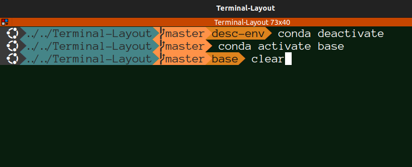

# Installing and Setting up Oh-My-Posh on Linux

[Oh-My-Posh](https://ohmyposh.dev/) is a powerful and customizable prompt theme engine for various command-line interfaces. It provides a wide range of themes and options to enhance your terminal experience. This guide will walk you through the process of installing and setting up Oh-My-Posh on Linux/bash, Also, this repo includes my terminal setup which is compact and neat.
<center>



</center>

## Installation Steps
1. For this tutorial, we will use [Homebrew](https://brew.sh/). First open terminal and install Homebrew,
```
/bin/bash -c "$(curl -fsSL https://raw.githubusercontent.com/Homebrew/install/HEAD/install.sh)"
```
and add Homebrew to the PATH (you can also follow these steps [from official site](https://docs.brew.sh/Homebrew-on-Linux#install)),
```
test -d ~/.linuxbrew && eval "$(~/.linuxbrew/bin/brew shellenv)"
test -d /home/linuxbrew/.linuxbrew && eval "$(/home/linuxbrew/.linuxbrew/bin/brew shellenv)"
echo "eval \"\$($(brew --prefix)/bin/brew shellenv)\"" >> ~/.bashrc
```

2. Now you should be able to install Oh-my-posh using Homebrew,
```
brew install jandedobbeleer/oh-my-posh/oh-my-posh
```

3. For the special characters in the theme, you need to install fonts. You can do so by running following command and then selecting the Nerd Font you like,
```
oh-my-posh font install
```
For my theme, I use AnonymousPro. Once you install it, you need to right click on Terminator, go to `Preferences/Profiles/General`, unselect `Use the system fixed width font` and select `AnonymicePro Nerd Font Regular`. If you don't see the installed fonts, restart your terminal.

4. Download `.yge-terminal-theme.omp.json` file from this repo and paste it to your `HOME` directory.

5. Add following line to your `.bashrc` file,
```
eval "$(oh-my-posh init bash --config ~/.yge-terminal-theme.omp.json)"
```
You can do so through `nano`,
```
nano .bashrc
```
and then copy/paste above line to the end of the file.

6. Run
```
exec bash
```

7. Restart your computer, and the new theme should be ready!

## Important Remark
This repo is specifically for Ubuntu operating system with bash as the main terminal shell. For other setups, please refer to [Oh-My-Posh](https://ohmyposh.dev/) documentation.
